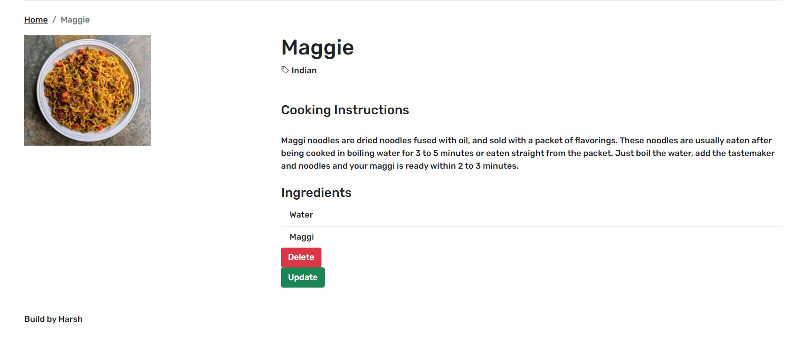

# Recipe-Blog
Designed and developed website showcasing different worldwide cuisine. It is a Node application built using bootstrap for front-end and MongoDB for database. Implimented features for adding, searching, updating and deleting recipes

## Features :
  - Users can create, edit, and remove Recipies.
  - Users can review Recipies once, and edit or remove their Recipies.

